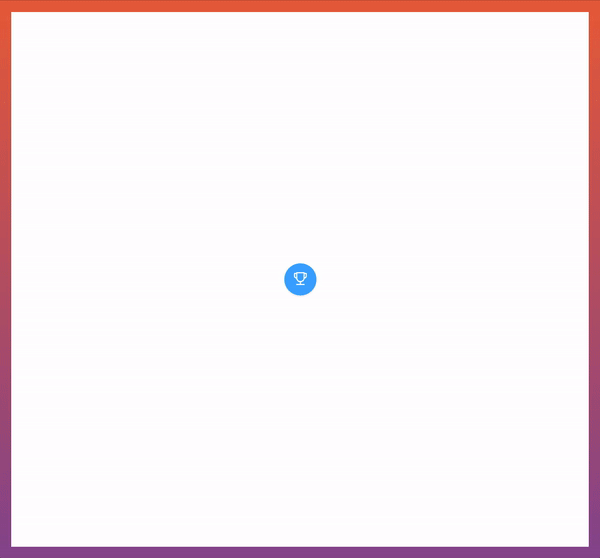

[](https://badge.fury.io/js/react-rewards) [](https://forthebadge.com)

### Demo available <a href="https://fmjo9.csb.app/" target="_blank">here!</a>

## Usage

This package was built using React-Pose, react-dom-confetti and Lottie-web.

Why should I use that? Read my blog post and you will know – https://www.thedevelobear.com/post/microinteractions/

Install from npm by typing ```npm install react-rewards``` or ```yarn add react-rewards``` while in your package.json directory.

This package lets you add microinteractions to your app, and rewards users with the rain of confettis, flying emoji or memphis design particles in seconds. In order to make it rain, you need to wrap your button of choice with the **\<Reward\>** component, fire the **rewardMe()** method from the refs and voilà. You can also "punish" the user by calling the **punishMe()** method and showing them that something went wrong. 

<p align="center">

</p>

```js
import Reward from 'react-rewards';

// in render
<Reward
  ref={(ref) => { this.reward = ref }}
  type='emoji'
>
  <button onClick={this.fetchSomeData} />
</Reward>

// in fetchSomeData:
// to reward a user with confetti/emoji/memphis rain:
this.reward.rewardMe();
// to "punish" user :
this.reward.punishMe();
```

### Props & config

Basic props:

| name            | type   | description                                            | required   |default      |
|-----------------|--------|--------------------------------------------------------|------------|-------------|
| ref             | func   | function that creates a ref of the reward component    | yes        |             |
| type            | string | 'confetti', 'emoji' or 'memphis'                       | no         |'confetti'   |
| config          | object | a configuration object described below                 | no         |see below    |

Config object: 

| name            | type   | description                                            | default (confetti / emoji) |
|-----------------|--------|--------------------------------------------------------|---------------------------|
| lifetime        | number | time of life of each particle in ms                    | 200 / 200                 |
| angle           | number | initial direction of particles in degrees              | 90 / 90                   |
| decay           | number | how much the velocity decreases with each frame        | 0.91 / 0.91               |
| spread          | number | spread of particles in degrees                         | 45 / 100                  |
| startVelocity   | number | initial velocity of particles                          | 35 / 20                   |
| elementCount    | number | particles quantity                                     | 40 / 15                   |
| elementSize     | number | particle size in px                                    | 8 / 20                    |
| zIndex          | number | z-index of particles                                   | 10 / 10                   |
| springAnimation | bool   | whether the button should be animated                  | true                      |
| colors          | array  | An array of colors used when generating confettis      |                           |
| emoji           | array  | An array of emoji used when generating emoji particles |                           |
