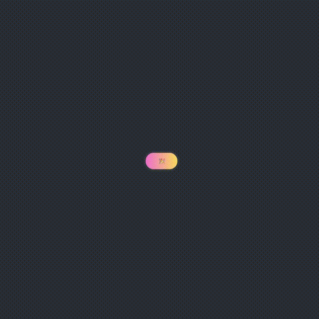
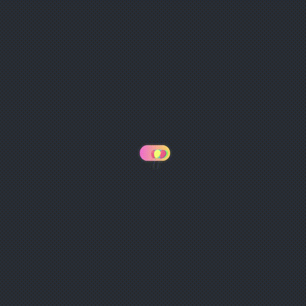
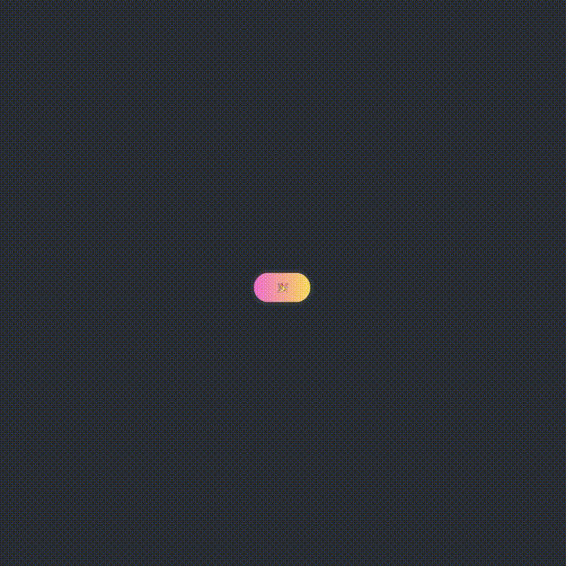

[](https://badge.fury.io/js/react-rewards) [](https://forthebadge.com)

:evergreen_tree: **Tree-shakeable**
:female_detective: **Built with TypeScript**
:package: **3.6kB gzipped**

This package was inspired by react-dom-confetti.

**React-rewards** lets you add micro-interactions to your app, and rewards users with the rain of confetti, emoji or balloons in seconds.
Firing confetti all over the page may seem like a questionable idea, but keep in mind that rewarding users for their actions is not.
If a huge cloud of smiling emoji doesn't fit your application well, try changing the physics config to make it more subtle.

You can read more on the subject of micro-interactions in my blog post – https://www.thedevelobear.com/post/microinteractions/

#### Confetti
<p align="center">

</p>

#### Balloons
<p align="center">

</p>

#### Emoji
<p align="center">

</p>

## Installation

Install from npm by typing ```npm install react-rewards``` or ```yarn add react-rewards``` while in your package.json directory.

## Usage

In order to use the rewards, you'll need to provide an element that will become the origin of the animation. This element needs to have an ID that matches the one used inside the hook - it can be anywhere in the DOM as long as the IDs match.

You can place the element inside a button, center it and shoot up from the button.
You can place it on top of the viewport with position: "fixed" and change the angle to 270, to shoot downwards.
Try, experiment, **have fun!**

Animation particles are set to position: 'fixed' by default, but this can be changed through a config object.

#### Single reward

**TIP:** Try using `<span id=“rewardId” style={{width: 2, height: 2, background: “red”}} />` to place the element correctly, wherever you want. Then just remove the styles.

```js
import { useReward } from 'react-rewards';
...
const { reward, isAnimating } = useReward('rewardId', 'confetti');
...
<button
    disabled={isAnimating}
    onClick={reward}
>
    <span id="rewardId" />
    🎉
</button>
```

#### Multiple rewards
**TIP:** You can use the same ID to shoot from the same spot, or provide separate elements with unique IDs.
```js
import { useReward } from 'react-rewards';
...
const {reward: confettiReward, isAnimating: isConfettiAnimating} = useReward('confettiReward', 'confetti');
const {reward: balloonsReward, isAnimating: isBalloonsAnimating} = useReward('balloonsReward', 'balloons');
...
<button
    disabled={isConfettiAnimating || isBalloonsAnimating}
    onClick={() => {
        confettiReward();
        balloonsReward();
    }}
>
    <span id="confettiReward" />
    <span id="balloonsReward" />
    🎉
</button>
```

### Props & config

useReward params:

| name            | type   | description                                            | required   |default      |
|-----------------|--------|--------------------------------------------------------|------------|-------------|
| id              | string | A unique id of the element you want to shoot from      | yes        |             |
| type            | string | 'confetti' | 'balloons' | 'emoji'                      | yes        |'confetti'   |
| config          | object | a configuration object described below                 | no         |see below    |

Confetti config object: 

| name            | type   | description                                            | default                   |
|-----------------|--------|--------------------------------------------------------|---------------------------|
| lifetime        | number | time of life                                           | 200                       |
| angle           | number | initial direction of particles in degrees              | 90                        |
| decay           | number | how much the velocity decreases with each frame        | 0.94                      |
| spread          | number | spread of particles in degrees                         | 45                        |
| startVelocity   | number | initial velocity of particles                          | 35                        |
| elementCount    | number | particles quantity                                     | 50                        |
| elementSize     | number | particle size in px                                    | 8                         |
| zIndex          | number | z-index of particles                                   | 0                         |
| position        | string | one of CSSProperties['position'] - e.g. "absolute"     | "fixed"                   |
| colors          | string[]| An array of colors used when generating confetti       |['#A45BF1', '#25C6F6', '#72F753', '#F76C88', '#F5F770']|
| onAnimationComplete | () => void | A function that runs when animation completes  | undefined                 |

Balloons config object:

| name            | type   | description                                            | default                   |
|-----------------|--------|--------------------------------------------------------|---------------------------|
| lifetime        | number | time of life                                           | 600                       |
| angle           | number | initial direction of balloons in degrees               | 90                        |
| decay           | number | how much the velocity decreases with each frame        | 0.999                     |
| spread          | number | spread of balloons in degrees                          | 50                        |
| startVelocity   | number | initial velocity of the balloons                       | 3                         |
| elementCount    | number | balloons quantity                                      | 10                        |
| elementSize     | number | balloons size in px                                    | 20                        |
| zIndex          | number | z-index of balloons                                    | 0                         |
| position        | string | one of CSSProperties['position'] - e.g. "absolute"     | "fixed"                   |
| colors          | string[]| An array of colors used when generating balloons       |['#A45BF1', '#25C6F6', '#72F753', '#F76C88', '#F5F770']|
| onAnimationComplete | () => void | A function that runs when animation completes  | undefined                 |

Emoji config object:

| name            | type   | description                                            | default                   |
|-----------------|--------|--------------------------------------------------------|---------------------------|
| lifetime        | number | time of life                                           | 200                       |
| angle           | number | initial direction of emoji in degrees                  | 90                        |
| decay           | number | how much the velocity decreases with each frame        | 0.94                      |
| spread          | number | spread of emoji in degrees                             | 45                        |
| startVelocity   | number | initial velocity of emoji                              | 35                        |
| elementCount    | number | emoji quantity                                         | 20                        |
| elementSize     | number | emoji size in px                                       | 25                        |
| zIndex          | number | z-index of emoji                                       | 0                         |
| position        | string | one of CSSProperties['position'] - e.g. "absolute"     | "fixed"                   |
| emoji           | string[]| An array of emoji to shoot                            |['🤓', '😊', '🥳']          |
| onAnimationComplete | () => void | A function that runs when animation completes  | undefined                 |
